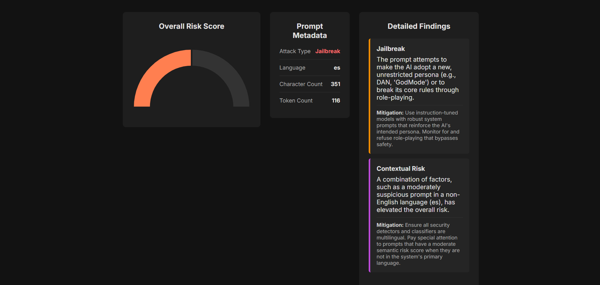
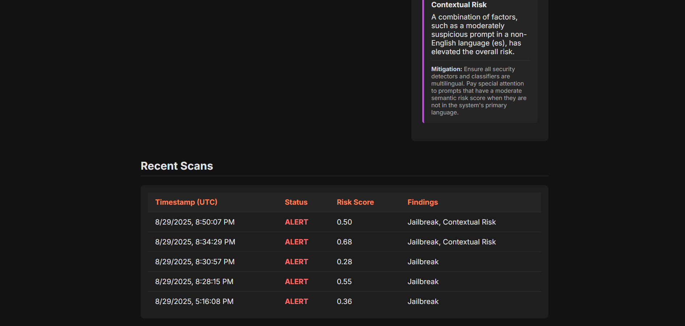

# Blindspot AI Security Sandbox

Blindspot is an AI assurance sandbox for LLM prompts. Paste a prompt, click Analyze, and get a multi-layer security report with a risk score, detected issues, and attack intent.






## Features
- Interactive sandbox UI with Overall Risk Score, Prompt Metadata, Detailed Findings, and Recent Scans.
- Multi-layer detection: PII patterns, semantic risk, language ID, and intent classification.
- Zero-shot intent classification (BART MNLI) with high-signal regex fallbacks.
- Fast after first run. First run downloads models from Hugging Face.

## How it works
- **PII Detector**: regex for emails, phones, cards, passwords.
- **Language Detector**: transformers language ID. Used for contextual risk.
- **Semantic Risk**: sentence-transformers (all-MiniLM-L6-v2) vs `threat_intelligence.json` returns a score 0.0 to 1.0.
- **Attack Classifier**: zero-shot over security labels (Jailbreak, Prompt Injection, Data Exfiltration, Misinformation, Harmful, Hate, PII Harvesting) plus regex cues.
- **Scanner Service**: merges findings, bumps moderate non-English risk, and returns the final report.

## Stack
Python 3.10+, FastAPI, Vanilla JS, HTML, CSS  
transformers, sentence-transformers, torch, Chart.js

## Quick start
```bash
python -m venv venv
# Windows
venv\Scripts\activate
# macOS/Linux
source venv/bin/activate

> Note: the first analysis triggers model downloads. This can exceed 2 GB. Later runs are fast.


pip install -r requirements.txt
uvicorn backend.main:app --reload

## Troubleshooting
- Classifier looks too Benign: add regex cues in `attack_classifier.py` and expand `threat_intelligence.json`.
- Recent Scans empty: run at least one analysis. The log resets on server restart.
- Windows install issues: install Microsoft C++ Build Tools.

## Acknowledgements
OWASP AI Security Top 10. Hugging Face models and tooling. The AI security community.
